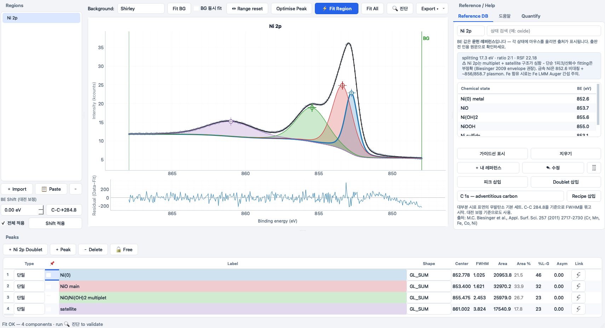

import { Card, CardGrid } from '@astrojs/starlight/components';

**Corepeak**은 익숙한 XPSPEAK 4.1 워크플로를 현대적 인터페이스로 재현하고, 한 걸음 더 나아갑니다.
단순히 XPS(X선 광전자 분광) 데이터를 피팅하게 해주는 게 아니라, **그 fit이 물리적·통계적으로
타당한지 검증**하고, 문헌 결합에너지를 알고 있어서 일일이 찾아볼 필요가 없습니다.

<CardGrid stagger>
  <Card title="🔍 내장 fit auditor" icon="approve-check">
    FWHM 타당성, 레퍼런스 DB 결합에너지 대조, doublet 무결성, 금속 라인섀입 비대칭, 예상 satellite,
    잔차 z-score, BIC, 그리고 데이터가 실제로 요구하지 않는 피크를 잡아내는 leave-one-out 필요성 검정.
  </Card>
  <Card title="📚 출처가 명시된 데이터베이스" icon="open-book">
    24개 원소의 결합에너지·spin-orbit 파라미터·RSF — 모든 값에 문헌 출처. 원클릭 fitting recipe.
    직접 쓰는 레퍼런스를 추가하면 업데이트해도 유지됩니다.
  </Card>
  <Card title="🖥️ 진짜 크로스플랫폼" icon="laptop">
    맥·윈도우 네이티브. XPSPEAK 같은 5,000점/51피크 제한 없음. 파이썬 설치 불필요, 계정 불필요,
    영구 무료 (GPLv3).
  </Card>
  <Card title="📥 무엇이든 불러오기" icon="download">
    .dat / .txt / .csv / .xlsx / .xls, Thermo Avantage 멀티시트, VAMAS, 또는 엑셀/오리진에서 두 열
    붙여넣기. KE→BE 변환 내장.
  </Card>
</CardGrid>

## 현대적 XPSPEAK 대체

| | Corepeak | XPSPEAK 4.1 | CasaXPS | KherveFitting / LG4X |
|---|---|---|---|---|
| 가격 | **무료 (OSS)** | 무료 | €830+ | 무료 (OSS) |
| 맥 네이티브 | ✅ | ❌ | ❌ | ✅ |
| 내장 fit auditor | ✅ | ❌ | ❌ | ❌ |
| 출처 명시 레퍼런스 DB | ✅ | ❌ | 일부 | ❌ |
| 원클릭 recipe | ✅ | ❌ | ✅ | ❌ |
| 활발한 유지보수 | ✅ | ❌ (1999) | ✅ | ✅ |

[Corepeak 다운로드 →](/corepeak/ko/download/) · [전체 기능 →](/corepeak/ko/features/) · [비교 →](/corepeak/ko/compare/)
